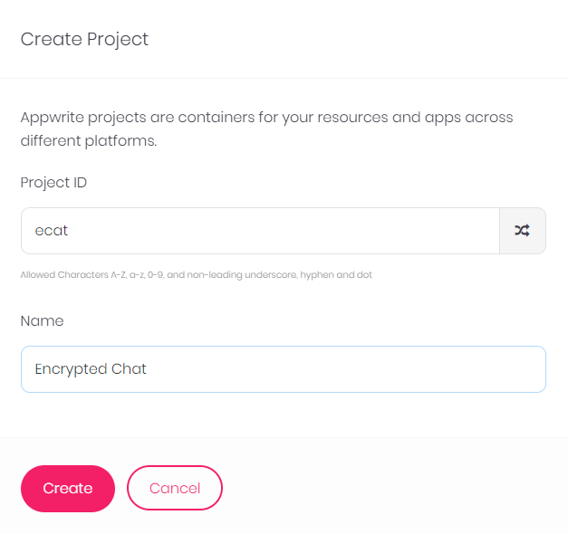
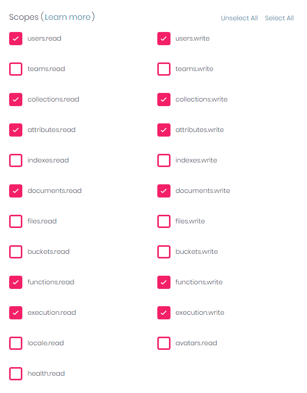
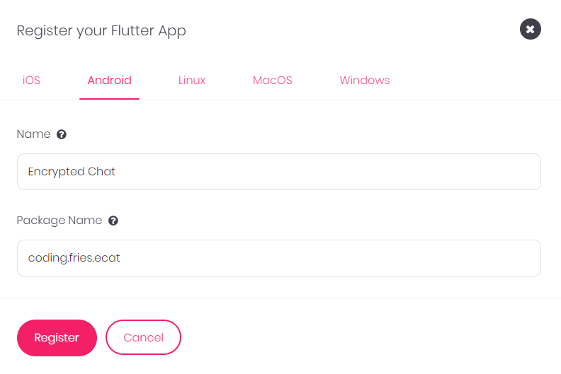

&nbsp;&nbsp;&nbsp;


# Encrypted Chat

> Self Hosted End to End Encrypted Chat System


With the power of Flutter and Appwrite, you can easily host your personal Encrypted chat system and this app demonstrates just how simple it can be. No more fear of being snooped, since you have all the control over your messages that are secured using a private key - and an even more awesome thing is that it's open source so you can modify it to make it however you want it to be. The encryption is based on public-private key pairs where private key is genrated on device and you can keep a backup of it using a QR code generated inside the app, which makes switching devices easy without data loss. The theme is based on appwrite's website - and everything else is just CUTE AND SECURE.

## Getting Started

To get a local copy up and running follow these steps.

# Setup Instructions

## Appwrite Installation
- Follow the steps mentioned on the official appwrite website for [instllation](https://appwrite.io/docs/installation) with docker
- In the directory where you ran the docker command, you will find a `.env` file
- Edit that file, find `_APP_FUNCTIONS_ENVS` and set it's value to `dart-2.16`
- Also delete the `_APP_FUNCTIONS_ENVS` field - Save the file
- In the same directory open a terminal or cmd and run the following command
```
docker-compose up -d
```
- This completes the docker setup

## Project Setup
- Open a browser and go to the `localhost:80` or if you set some other port
- Signup and remember the credentials - you will need them
- Create a new Project as shown below `Keep the project id as ecat` unless you want to rebuild your application.



- Create an API Key with atleast these 12 permissions



- Register Your Flutter Project



## Database and Functions

- Install the [appwrite cli](https://appwrite.io/docs/command-line)
- Open a directory and login to appwrite cli in a terminal or cmd
```
appwrite login
```
- Enter credentails used for signing up - Leave host as default unless you know what you are doing
- Download this script for [windows](./resources/create.cmd) or for [linux](./resources/create.sh)
- Run the script with following arguments
For Linux
```
./create.sh yourProjectID yourProjectName yourHost yourAPIKey
```
For Windows
```
./create.cmd yourProjectID yourProjectName yourHost yourAPIKey
```
- This will create an appwrte.json in your directory
- Now Download this [functions.zip](./resources/functions.zip) and extract in the same directory
- Run the follwing command
```
appwrite deploy --all
```
- Select all `a` and `enter` then again select all `a` and `enter`
- This will setup everything for you

## Known Bug

- The above command `appwrite deploy -all` might fail while deploying functions and give you an error `Unexpected token`
- If that's the case then you will have to create functions manually
- Open appwrite in browser `localhost:80` and go to functions
- You have to add three new functions with following ids:
```
1. createMessageCollection
2. createUserDocument
3. notifyUser
```
For all three of these you have to add these variables in the settings


For `createMessageCollection` and `notifyUser` add this in Execute access section:
```
role:member
```


and For `createUserDocument` check the account.create event


- Now run these [commands](./resources/commands.txt) one by one in the same directory where you have the appwrite.json and functions
- After this all your functions will be deployed

## Usage

Open your app and set your parameters by clicking the settings icon on the login screen - Enjoy free and private encrypted chat

## Future Improvements

- Multi Platform Support - especially Web
- Push Notifications implementation (when appwrite releases support or maybe using firebase)
- File Transfer - soon
- Message Data Persistance

## Authors

👤 **Awais Amjed**

- GitHub: [@Awais Amjed](https://github.com/awais-amjed)
- LinkedIn: [LinkedIn](https://www.linkedin.com/in/awais-amjed)

## 🤝 Contributing

Contributions, issues, and feature requests are welcome!

Feel free to check the [issues page](../../issues/).

## Show your support

Give a ⭐️ if you like this project!

## Acknowledgments

- FlatIcons - All images used are from [Flaticon](https://www.flaticon.com/) - Love their collections ❤️

## Attributions

- <a href="https://www.flaticon.com/free-icons/cat" title="cat icons">Cat icons created by Freepik - Flaticon</a>
- <a href="https://www.flaticon.com/free-icons/identity" title="identity icons">Identity icons created by srip - Flaticon</a>
- <a href="https://www.flaticon.com/free-icons/server" title="server icons">Server icons created by Freepik - Flaticon</a>
- <a href="https://www.flaticon.com/free-icons/user" title="user icons">User icons created by Freepik - Flaticon</a>
- <a href="https://www.flaticon.com/free-icons/access" title="access icons">Access icons created by Eucalyp - Flaticon</a>
- <a href="https://www.flaticon.com/free-icons/password" title="password icons">Password icons created by Freepik - Flaticon</a>
