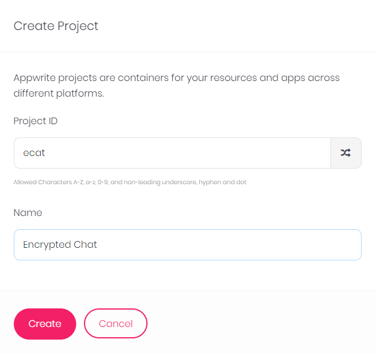
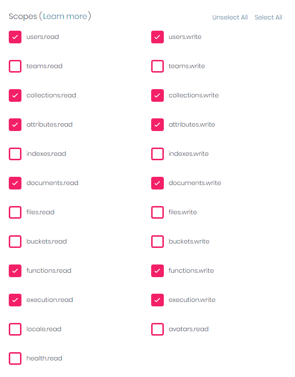
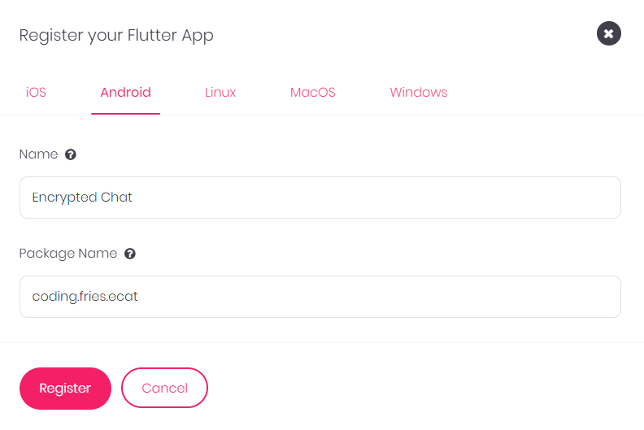

&nbsp;&nbsp;&nbsp;


<br>
<br>

# Encrypted Chat

> Self Hosted End to End Encrypted Chat System


With the power of Flutter and Appwrite, you can easily host your personal Encrypted chat system and this app demonstrates just how simple it can be.

## Getting Started

To get a local copy up and running follow these steps.

# Setup Instructions

## Appwrite Installation
- Follow the steps mentioned on the official appwrite website for [instllation](https://appwrite.io/docs/installation) with docker
- In the directory where you ran the docker command, you will find a `.env` file
- Edit that file, find `_APP_FUNCTIONS_ENVS` and set it's value to `dart-2.16`
- Also delete the `_APP_FUNCTIONS_ENVS` field - Save the file
- In the same directory open a terminal or cmd and run the following command
```
docker-compose up -d
```
- This completes the docker setup

## Project Setup
- Open a browser and go to the `localhost:80` or if you set some other port
- Signup and remember the credentials - you will need them
- Create a new Project as shown below `Keep the project id as ecat` unless you want to rebuild your application.



- Create an API Key with atleast these 12 permissions



- Register Your Flutter Project



## Database and Functions

- Download this file

### Usage

Open index.html in Chrome

## Authors

👤 **Author1**

- GitHub: [@Awais Amjed](https://github.com/awais-amjed)
- Website: [@Coding Fries](https://codingfries.com)
- LinkedIn: [LinkedIn](https://www.linkedin.com/in/awais-amjed)

## 🤝 Contributing

Contributions, issues, and feature requests are welcome!

Feel free to check the [issues page](../../issues/).

## Show your support

Give a ⭐️ if you like this project!

## Acknowledgments

- Microverse
